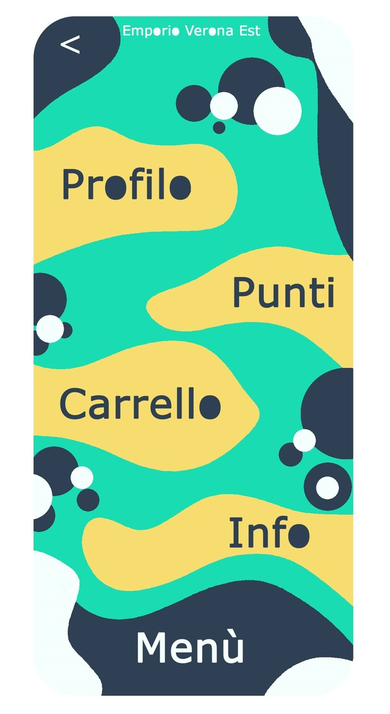

## Verona East Emporium Graphics
In this folder you can find the various images related to a first graphic idea of the application.
## 1. Login Window

This is the Login Page where you can log into the application using your email and password.

## 2. Registration Window
If you do not have an account you can register and the following is the image that proposes a possible registration window.

## 3. Home Window
Once you have logged in, or registered, you will access the following page which will be essentially the home page of the application where the various product categories will be indicated:
- Condents
- Breakfast
- Flesh
- Cereals
- Farine
- Fruits and vegetables
- Milk and dairy products
- Legumes
- Bread and related
- Pasta and rice
- Fish
- Sweets
- Salse
- Sundry
- Detergents
- Personal hygiene

## 4. Options Window
The following image refers to the options that the user has access to from his account, options that include:
- Profile
- Points (payment units)
- Cart (Goods taken)
- Info

